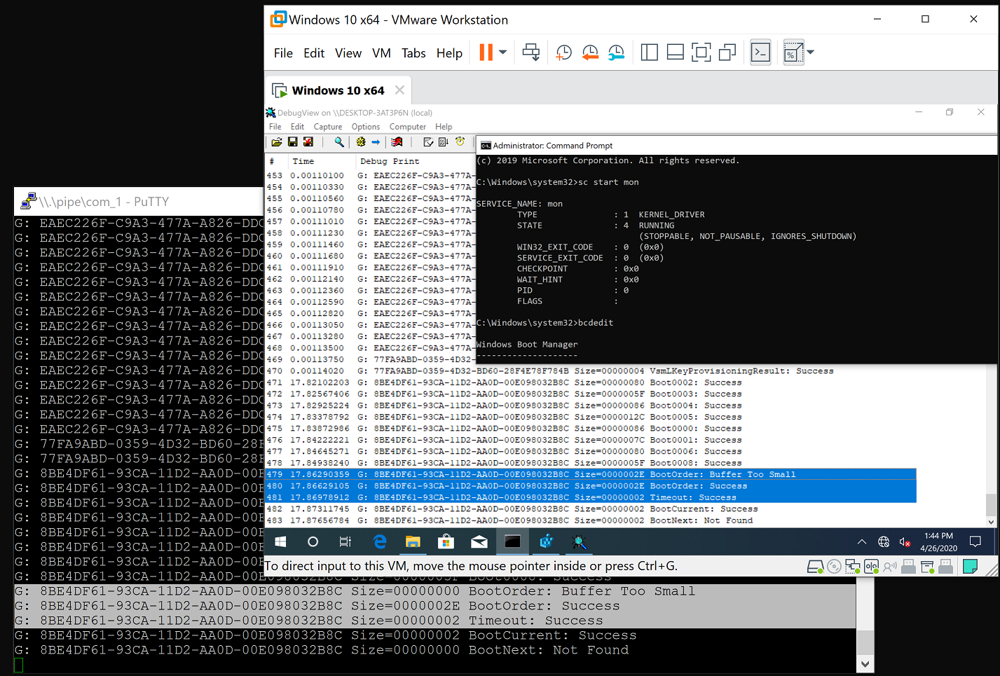
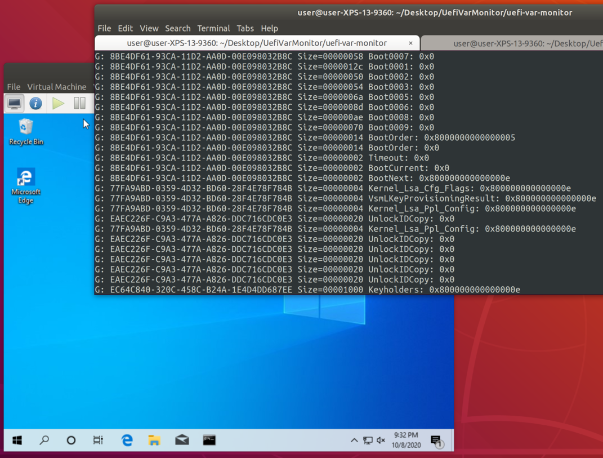

UefiVarMonitor
===============

The sample runtime DXE driver (UEFI driver) monitoring access to the UEFI variables by hooking the runtime service table in C and Rust.

This project was developed to provide a small sample of a runtime driver.




Rust implementation was made solely for author's learning.

Projects Overview
------------------

* UefiVarMonitorDxe

    The UEFI runtime driver that hooks `GetVariable` and `SetVariable` runtime services, and logs the use of them into serial output. Written in less than 300 lines of C code.

* uefi-var-monitor

    Nearly equivalent implementation of `UefiVarMonitorDxe` in Rust. Unsafe, unsafe everywhere.

* UefiVarMonitorExDxe

    The enhanced version of `UefiVarMonitorDxe` allowing a Windows driver to register an inline callback of the above runtime services. This can also be used to alter parameters and block those calls.

* UefiVarMonitorExClient

    The sample Windows driver registering a callback with `UefiVarMonitorExDxe`.

Building
---------

* UefiVarMonitorDxe and UefiVarMonitorExDxe

    1. Set up edk2 build environment
    2. Copy `UefiVarMonitorPkg` as `edk2\UefiVarMonitorPkg`
    3. On the edk2 build command prompt, run the below command:
        ```
        > edksetup.bat
        > build -t VS2019 -a X64 -b NOOPT -p UefiVarMonitorPkg\UefiVarMonitorPkg.dsc -D DEBUG_ON_SERIAL_PORT
        ```
       Or on Linux or WSL,
        ```
        $ . edksetup.sh
        $ build -t GCC5 -a X64 -b NOOPT -p UefiVarMonitorPkg/UefiVarMonitorPkg.dsc -D DEBUG_ON_SERIAL_PORT
        ```

* uefi-var-monitor

    1. Install the nightly rust compiler. Below is an example on Linux, but it is largely the same on Windows.
        ```
        $ sudo snap install rustup --classic
        $ rustup default nightly
        $ rustup component add rust-src
        ```
    2. Build the project.
        ```
        $ cd uefi-var-monitor
        $ cargo build
        ```

* UefiVarMonitorExClient

    This is a standard Windows driver. VS2019 and WDK 10.0.18362 or later are required.

Credits
---------

- Thank you [@x1tan](https://twitter.com/x1tan) for modernalized xcargo-less build. 
